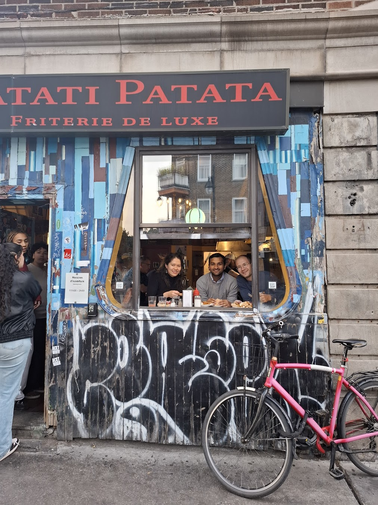

# Things to do in Montréal

A non-comprehensive list of places to go and things to do in Montréal curated by [Marius](https://mariusmosbach.com/), [Benno](https://bennokrojer.github.io/) and, [Michael](https://michaelrizvi.github.io/). Some of the information might be outdated so please double-check on Google Maps.

Credit: This list was inspired by [Vagrant's Vancouver](https://dippedrusk.com/posts/2024-05-09-vancouver/).

## Table of Contents

- [Getting around](#getting-around)
- [Food](#food)
  - [Bakeries](#bakeries)
  - [Bagels](#bagels)
  - [Burger](#burger)
  - [Cafés](#cafés)
  - [Poutine](#poutine)
  - [Pizza](#pizza)
  - [Sandwiches](#sandwiches)
  - [Ramen](#ramen)
  - [Chinese](#chinese)
  - [Mexican](#mexican)
  - [Thai](#thai)
  - [Food courts](#food-courts)
  - [Other](#other)
- [Drinks](#drinks)
- [Bookstores](#bookstores)
- [Museums](#museums)
- [Parks](#parks)
- [Vintage shopping](#vintage-shopping)
- [Misc.](#misc)

## COLM 2025 specific info

[COLM 2025](https://colmweb.org/) will happen from October 7th to 10th at the [Palais des Congrès](https://maps.app.goo.gl/2KBzjB32JPW4WBkh8) in Downtown Montréal. In my opinion (Marius), this is the least interesting part of Montréal. Luckily, the Palais des Congrès is connected to the Place-d'Armes metro station (orange line), so it will be easy to explore the city from there. At least you're very close to Montreal's most famous church, Notre-Dame!

## Getting around

- [Bixi](https://bixi.com/en/): Bixi is a bicycle sharing system in the metropolitan are of Montréal. It's a great way to explore the city. Make sure to download and setup the app beforehand.
- [STM](https://www.stm.info/en): STM is the public transport agency in Montréal. They operate busses and Montréal metro. See here for [fares](https://www.stm.info/en/info/fares/transit-fares). You can buy tickets at ticket machines inside the metro stations using cash or credit cards.
- Walking. Montréal is a very walkable city. We highly recommend walking around it's many great neighborhoods.

## Food

### Bakeries

- [Louise Boulangerie](https://maps.app.goo.gl/8acG9PFjCZh5abgP6): A go-to place for Mila folks to get some of the best croissants, or other fancy pastries, in town.
- [Pasticceria Alati-Caserta](https://maps.app.goo.gl/DtGzA6NL33p6JJAx5): todo
- [Aux Merveilleux de Fred](https://maps.app.goo.gl/ADSwaYqUXA4p2Uyt6): todo
- [Hof Kelsten](https://maps.app.goo.gl/MW99CW7zrQHAs9zw7): Very good baguette and croissants.
- [Toledo](todo): Very popular bakery in the Plateau.
- [Pâtisserie Coco](https://maps.app.goo.gl/dX6sAmy9QseQr5PR9): Nice Chinese bakery in Chinatown.
- [Padaria Portuguesa](https://maps.app.goo.gl/S7UiiBdYukdu55Ri6): Make sure to try their Pastel de Nata.

### Bagels

- [Fairmount Bagel](https://maps.app.goo.gl/K3wBonNEYAmaypHj6): Arguably the best bagel place in town. There is a huge rivalry with the slightly more famous St Viateur. But we are loyal to Fairmount bagels! It is open 24/7, so get oven-fresh bagels after a long night out! This institution of Montreal culture is surrounded by two other iconic places: Gnocchi and Kem Coba (ice cream). Paying by cash is recommended. +5% fee for using a credit card.
- [St-Viateur Bagel](https://maps.app.goo.gl/tufpCjcKPkJFLEdz5): The other famous bagel bakery in Montréal. They also have a café on Rue Mont Royal (very long line on the weekend). They also have a [café](https://maps.app.goo.gl/zLywjdL8pChoGCzL8) on Rue Mont Royal.

Make sure to try both and let us know which one you like better ;).

### Burger

- [MangeDansMonHood](https://maps.app.goo.gl/P89tYV1uarXhe4vLA): Some say this is the best burger in Montréal. They might be right.
- [Double’s](https://maps.app.goo.gl/sCdWeujHPJcNdMjs9): todo
- [Notre Boeauf de Grace](https://maps.app.goo.gl/Ejviouy3fKMvCbZ89): Probably Benno's favourite burger place with fond memories.

### Cafés

Montreal has a ridicioulsy good coffee scene and you can find great coffee shops in most neighborhoods. Below is a non-exhaustive list of some of our favorite coffee shops.

- [Café Myriade - Mont-Royal](https://maps.app.goo.gl/JJba3MmuW42NfHi4A): Nice coffee shop with a slightly more Italian vibe. Has a fun outdoor sitting area. Marius' favorite café to work from.
- [Café Caron & frères](https://maps.app.goo.gl/9ZJKtPH6oS27F6sG6): Coffee shop owned by two brothers. They don't roast but they offer a selection of beans from Canada and the world which they often change! One of the best cafés in the city.
- [Café Even](https://maps.app.goo.gl/92kz7BXFwPPxq5Ju7): Near the Mila building. Roast their own beans on site. Great pour overs. Definitely worth a visit.
- [Café Paquebot Mont-Royal](https://maps.app.goo.gl/VnSomV9nFTGn1wdCA): Lowkey third-wave coffee shop. Try the miso caramel latte!
- [Crew Collective & Cafe](https://maps.app.goo.gl/NhjwJF2AKFTGWEBR9): Café in a very pretty building. Gets very crowded on the weekend.
- [Novanta](https://maps.app.goo.gl/1pfjgYeRZFgKac2R9): Benno's favourite cafe for the vibes and the lovely Italian owners.

### Poutine

You CANNOT visit Montréal without having poutine.

- [Ma Poule Mouillée](https://maps.app.goo.gl/dhssyYFJbC7wVfm7A): TODO
- [Romados](https://maps.app.goo.gl/xTUuWhCc7NNt3ynT7): If you like chicken on your poutine, go here.
- [Patati Patata Friterie de Luxe](https://maps.app.goo.gl/u1oQmuMz7GcEanpDA): Benno's and Marius' favorite poutine place. Very small place with great vibes. (Benno: they add a bit of wine to the sauce *chef's kiss*)
- [Chez Claudette](https://maps.app.goo.gl/d1i5M9c4L9UD7Eb78): Casse-croûte with a large selection of poutine.
- [La Banquise](https://maps.app.goo.gl/s6j96aWxWRgTq5637): The most famous poutine in Montreal. 24/7 open, very diverse toppings.

  
   
  <em>Some of us at Patati Patata - true Montreal vibes</em>

### Pizza

- [Pizza Bouqet](https://maps.app.goo.gl/M2ZyMUtcM1gAAUkRA): Great no frills NY-style pizza place selling pizza by the slice.
- [Pizza Il Focolaio](https://maps.app.goo.gl/ZgQgMfqLixSTQizK6): Great Italian restaurant in Downtown. Also make sure to try their salad.
- [Café San Gennaro](https://maps.app.goo.gl/ZwLmFg1i3rRsk9Vr9): Roman square pizza sold by the slice. Try the potato pizza. Maybe have dessert also, they have a great selection of Italian pastries.
- [Pizza Toni](https://maps.app.goo.gl/PwiScf97sRnxLDmBA): Another great NY-style pizza place.
- [SEGRETA](https://maps.app.goo.gl/MoMPPirLoM49dskG9): todo

### Sandwiches

- [Kahwa Café](https://maps.app.goo.gl/gG9XgS2mq5r35toA9): todo
- [Capitaine Sandwich](https://maps.app.goo.gl/nfB4ggNEuHiTBjcp9): todo
- [Dépanneur Le Pick Up](https://maps.app.goo.gl/YTQeR4wVgKF8Eod49): great spot near Mila, the halloumi sandwich is great (Benno)
- [Lester's Deli](https://maps.app.goo.gl/ccxBr5YqsasHuCFy5): Smoked meat
- [PIAZZA SALUMI](https://maps.app.goo.gl/tK2FvakZNC8EuZcA6): right in the heart of Little Italy, and you feel that from the second you walk in.
- [Panino Pazzo](https://maps.app.goo.gl/LQxi8FG7DPX6cCC3A): todo
- [Schwartz's Deli](https://maps.app.goo.gl/tpSRi8D8EXTzywWB6): An institution in Montréal on Saint-Laurent street. Best known for their smoked meat sandwiches.
- [Wilensky's](https://maps.app.goo.gl/YgvEMPYVbvqQWyk9A): old-school, down-to-earth, cash-only, iconic, you feel not much has changed much since the 40s/50s/60s.
- [Renzo's](https://maps.app.goo.gl/pJm3xZLskPw8MbMY7): Relatively new sandwich place in Mile-End. #HipsterMileEnd. Great Italian style sandwiches with a twist. Big portions one sandwich for two is plenty.

### Ramen

- [Yokato Yokabai Ramen](https://maps.app.goo.gl/MvvoYV79zyFKZwG77): Hands down the best Ramen in Montréal. It's a bit pricy though.
- : todo

### Chinese

- [Nouilles Zhonghua](https://maps.app.goo.gl/UrnAMH1fAMmvNrUL8): Best Chinese noodles in town. Closed on the weekend!
- [Nouilles de Lan Zhou](https://maps.app.goo.gl/aQ3QfvDTvNdZ2gWo8): Another great Chinese noodles place. Get very busy on the weekend.
- [Fondue Haidilao](https://maps.app.goo.gl/TiXRBTXtHhVtYXDF8): Solid hotpot place with a show.
- [Sammi & Soupe Dumpling](https://maps.app.goo.gl/apPpRtV9mj14K5JS8): One of the best dumpling places in Montréal.

### Mexican

- [La Capital](https://maps.app.goo.gl/UjXh5y8gk1yED3q19): Solid taqueria near Chinatown. Regarded as one of the best in Montréal.
- [La Toxica](https://maps.app.goo.gl/oV86RgCY3NUj1LHt5): Specialize in tacos de Birria, which are braised beef tacos with cheese served with the consommé (broth) on the side. Great for cold nights.
- [Carnitas Michoacanas](https://maps.app.goo.gl/GT8LHwkmNWoBzohE7): Specialize in carnitas. Ask for buch or orejas if feeling adventurous.
- [Tacos Victor](https://maps.app.goo.gl/93oAUqbH3r6WTE1p6): Institution near Griffintown. Great tacos de lengua and steak tacos.

### Thai

- [Épicerie Pumpui](https://maps.app.goo.gl/KnzMkDtcfHooraxZA): Small thai counter near Mila serving up homemade curries, pad thai and other delights. If you like thai food, this is a must visit.
- [Pichai](https://maps.app.goo.gl/YpHdjCYL43J1JyyX9): Sister restaurant to Pumpui. More of a sit-down vibe with plates to share and a menu that changes with the seasons.

### Food courts

- [LE CENTRAL](https://maps.app.goo.gl/dYEvsageEpcccKh27): Food court near Chinatown not too far from the Palais des Congrès. If you are a big group, this is a good option.
- [Time Out Market Montréal](https://maps.app.goo.gl/QMCSPh5Y13RXjkj97): Another large food court in Downtown.

### Other

- [Drogheria Fine](https://maps.app.goo.gl/u9NHyVLAmLiQWPcd7): Cheap counter for piping hot gnocchi served with bolognese and a mountain or parmesan.
- [Falafel Yoni](https://maps.app.goo.gl/3kLAFpCzBRVwWpVJ8): One of the best falafel places around Mile-End.
- [Bernie Beigne](https://maps.app.goo.gl/rgt87PZh5deHvKah9): Get the glazed donuts. Get very busy on the weekend.
- [Jean-Talon Markt](https://maps.app.goo.gl/LwG67j3SZxG36GNM7): Nice farmers market. There are several restaurants and cafes around the market as well. Definitely worth a visit.
- [Stash Café](https://maps.app.goo.gl/bwVttvJqoTN7UQGVA):
- [Tesfa](https://maps.app.goo.gl/LgtG9jzD4J42wCcc9): todo
- [La Belle Tonki](https://maps.app.goo.gl/sRvj9QxgY9EvuRh78): todo

## Drinks

- [Réservoir - Brasseur](https://maps.app.goo.gl/VdsaxHwF4HxnoTcU9): One of Marius' favorite bars in Montréal. They have a nice rooftop terrace which fills up fast.
- [Brasserie Dieu du Ciel!](https://maps.app.goo.gl/PrSj4CjsNvpyedYg6): Great local brewery offering their own beers.
- [Vices & Versa](https://maps.app.goo.gl/bgP3Y5czj4eZMw2z6): Amazing bar in Little Italy with a large selection of beers. They have a great beer garden. They have a solid poutine as well.
- [Taverne Atlantic](https://maps.app.goo.gl/JvxGUmWPMHGz3asYA): Another great bar with a beautiful rooftop terrace. They also have a good menu. Make sure to try their pizza and hotdogs.
- [Bar Star Bar](https://maps.app.goo.gl/nnz6tGwKQfTkJPx79): The bar version of Pizza Bouqet. If you enjoy Pizza with your beer, this is the place to go.
- [HELM - Microbrasserie sur Bernard](https://maps.app.goo.gl/We6QFRXiVk2tFLbg6): Another solid bar with nice indoor seating. They offer a XXL poutine to share.
- [Brewskey](https://maps.app.goo.gl/QxTHdbFVbqWyjHK36): Brewery in the oldtown not too far from the Palais des Congrès.
- [Terrasse St-Ambroise](todo): Great beer garden along the canal (e.g. do a bike ride and get a beer here). Check on their website for the opening hours.

## Bookstores
- [The Word](https://maps.app.goo.gl/MaQD6GduVRRg1JpE6): iconic book store near McGill catering to young intellectuals.
- [Joie de Livre](https://maps.app.goo.gl/Fg6yqeHxNaf2cDWE9): bookstore, cafe, bar, all in one place.

## Museums

- [Pointe-à-Callière](todo): Archeological museum in the old town. This is a great place to learn about the history of Montréal.

## Parks

You have to bring a snack if you plan to drink alcohol in a park.

- : todo
- : todo
- : todo

## Vintage shopping

- [Eva B](https://maps.app.goo.gl/GUzSWNuSgj33ox5x6): the most well-known thrift store in town. Has a fancier cousin called Eva D down the street.
- : todo

## Misc.

- Walk up Mont-Royal.
- Biking along the Lachine canal.
- Botanical Garden is open at night during fall with a light show: [Gardens of Light](https://calendrier.espacepourlavie.ca/gardens-of-light)
- Montreal is famous for its murals (wall art). There are some guided tours!
- A crowdsourced map of the vibe of each neighborhood: [HoodMaps Montreal](https://hoodmaps.com/montreal-neighborhood-map).
